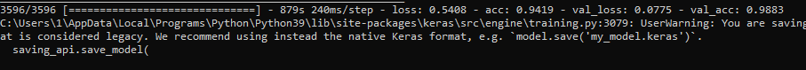
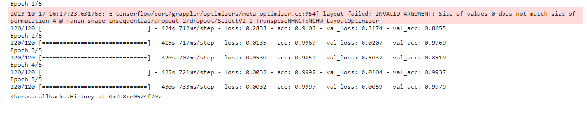

# <b>Project-OAB
## <b>Project Omega Arknigth Believe
### <b>Introduction
<b>A program that combined an autoclicker and autoresource allocation for a mobile game: Arknights, using optical character recognition and image classification models.

### <b>How to install?
1. First install git.
```
winget install --id Git.Git -e --source winget
```
2. Second, create a folder on your desktop or wherever is convenient for you.
3. Third, right-click on the folder and select open git bush here
4. Fourth, copy the repository using the following command.
```
git clone https://github.com/URLbug/Project_O.A.B.git
```
5. Fifth, install <a href="https://www.python.org/">python</a> from the official website.
6. Sixth, open the folder you made and write the cmd command in the path line.

7. Seventh, enter the following command and install the necessary libraries.
```
pip install -r requirements.txt
```
8. Eighth, after you have installed everything and done everything correctly, we write the following command, which launches the application.
```
python main.py
```
If you did everything correctly, then that's all and now you can use this application.

### <b>How to use it?
1. Download <a href="https://www.bluestacks.com/download.html">Bluestack</a>, for Arknights to run on computer.

2. Single Monitor users: run main.py, then immediately switch to the Bluestack software with full screen.

3. Multiple Monitors users: Open the Bluestack software on top of your main screen then run main.py

### <b>Tree Structure

    D:.
    |   .dockerignore
    |   .gitignore
    |   Dockerfile
    |   keyboards.json
    |   main.py
    |   model.py
    |   README.md
    |   requirements.txt
    |   sanity.png
    |   screen.png
    |   tree.txt
    |   __init__.py
    |   
    +---clickers
    |       clickers.py
    |       OCR_clikers.py         
    |           
    +---controllers
    |       keyboards.py
    |       setings.py
    |       status.py          
    |           
    +---image
    |       evalute.png
    |       image.png
    |       tutorial.png
    |       
    +---model
    |       beta_resnet.h5
    |       
    +---notepade
    |       beta-resnet.ipynb
    |       
    +---src
        dataset.py
        layers.py
        normal.py
        OCR.py
        resnet.py
        train.py
        unzip.py

### <b>Dataset
The dataset was taken from the mastermind of this project, namely Ely2112. You can find his project <a href="https://github.com/Ely2112/Arknights-Auto-Clicker/tree/main">here</a>. Special thanks to him <3

### <b>Model architecture and total accuracy
    Model: "sequential"
    _________________________________________________________________
    Layer (type)                Output Shape              Param #   
    =================================================================
    conv2d_13 (Conv2D)          (None, 32, 32, 64)        9472      
                                                                    
    max_pooling2d_1 (MaxPooling  (None, 10, 10, 64)       0         
    2D)                                                             
                                                                    
    residual_5 (Residual)       (None, 10, 10, 64)        8832      
                                                                    
    residual_6 (Residual)       (None, 10, 10, 64)        8832      
                                                                    
    dropout_2 (Dropout)         (None, 10, 10, 64)        0         
                                                                    
    residual_7 (Residual)       (None, 5, 5, 64)          45760     
                                                                    
    residual_8 (Residual)       (None, 5, 5, 64)          8832      
                                                                    
    dropout_3 (Dropout)         (None, 5, 5, 64)          0         
                                                                    
    global_average_pooling2d_1   (None, 64)               0         
    (GlobalAveragePooling2D)                                        
                                                                    
    flatten_1 (Flatten)         (None, 64)                0         
    ...
    Total params: 100,938
    Trainable params: 99,914
    Non-trainable params: 1,024

1. Version 1. My PC CPU.


2. Version 2. Kaggle GPU-T4 x2.


### <b>Model OCR
The OCR model was used from Microsoft.  
<a href="https://huggingface.co/microsoft/trocr-base-stage1">Here</a> you can get acquainted with the model in more detail.

### <b>Technologies that were used
### Tensorflow

### PyTorch

### Scikit-Learn